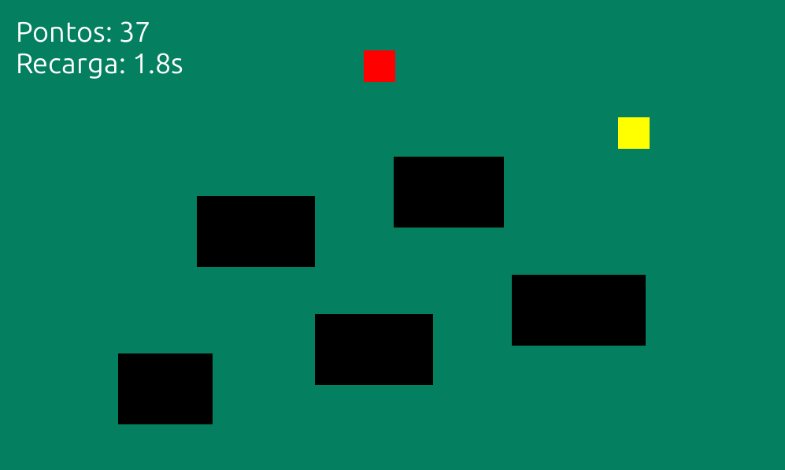

COIN RUN

Coin Run é um jogo desenvolvido em Python como projeto de programação. O objetivo do projeto foi colocar em prática conceitos de lógica de programação e desenvolvimento de jogos utilizando a biblioteca Pygame.

Sobre o projeto

No jogo, o jogador controla um personagem em um mapa e deve coletar as moedas disponíveis enquanto se movimenta pelo cenário.

O projeto começou como uma ideia simples e foi sendo desenvolvido conforme novas mecânicas eram adicionadas e testadas. Durante o desenvolvimento, foram trabalhados conceitos como movimentação, colisões, estruturas condicionais, funções e sistema de pontuação.

Demonstração

A imagem acima apresenta o jogo em funcionamento.

Como jogar

O objetivo é controlar o personagem pelo mapa e coletar as moedas.

Controles
Tecla	Ação
W / ↑	Mover para cima
A / ←	Mover para a esquerda
S / ↓	Mover para baixo
D / →	Mover para a direita
Objetivo

Durante a partida, o jogador deve:

Controlar o personagem pelo mapa;
Coletar as moedas;
Evitar os obstáculos;
Obter a maior pontuação possível.
Funcionalidades
Movimentação do personagem;
Sistema de coleta de moedas;
Detecção de colisões;
Obstáculos no mapa;
Sistema de pontuação;
Interação entre os elementos do jogo.
Tecnologias utilizadas
Python
Pygame

O projeto foi desenvolvido utilizando Python e a biblioteca Pygame para criar a janela, os elementos visuais, a movimentação e as interações do jogo.

Estrutura do projeto
Coin-Run/
│
├── coinrun/          # Arquivos relacionados ao jogo
├── imagens/          # Imagens utilizadas no projeto
├── dist/             # Arquivos gerados durante a criação do executável
├── build/            # Arquivos temporários da compilação
├── main.exe          # Executável do jogo
├── main.spec         # Configuração utilizada pelo PyInstaller
├── teste.py          # Arquivo utilizado para testes
├── requirements.txt  # Dependências do projeto
├── README.md         # Documentação
└── License           # Licença do projeto
Instalação
Requisitos

Para executar o código-fonte, é necessário ter:

Python 3 instalado;
PIP;
Git.
1. Clone o repositório
git clone https://github.com/israelvaz121/Coin-Run.git
2. Entre na pasta do projeto
cd Coin-Run
3. Instale as dependências
pip install -r requirements.txt

O arquivo requirements.txt contém a biblioteca necessária para executar o jogo:

pygame
Executando o jogo

Depois de instalar as dependências, execute o arquivo principal do jogo com Python.

python main.py

Caso o arquivo principal esteja dentro da pasta coinrun, utilize o caminho correspondente, por exemplo:

python coinrun/main.py
Executável

O repositório também possui uma versão compilada do jogo em formato .exe.

No Windows, é possível executar:

main.exe

sem precisar executar o código-fonte diretamente.

Exemplo de execução

Após instalar as dependências e iniciar o jogo, uma janela do Coin Run será aberta.

Resultado esperado:

O jogo inicia normalmente;
O personagem aparece no mapa;
O jogador pode movimentá-lo utilizando W, A, S, D ou as setas;
As moedas podem ser coletadas durante a movimentação;
O sistema de pontuação é atualizado conforme o jogador coleta as moedas.
O que eu aprendi

O desenvolvimento do Coin Run ajudou a colocar em prática conceitos importantes de programação.

Durante o projeto, foram trabalhados:

Lógica de programação;
Estruturas condicionais;
Funções;
Variáveis;
Movimentação de objetos;
Detecção de colisões;
Sistema de pontuação;
Organização de um projeto de software;
Desenvolvimento de jogos com Python e Pygame.

Além da programação, o projeto também mostrou a importância de testar e corrigir diferentes partes do código até que o jogo funcionasse corretamente.

Licença

Este projeto está licenciado sob a licença MIT.

Consulte o arquivo License para mais informações.

Autor

Desenvolvido por Israel Vaz.

⭐ Se você gostou do projeto, considere deixar uma estrela no repositório!